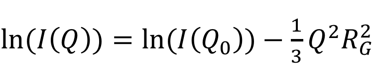

# SANS_spectra_Guinier_approx
Using the Guinier approximation, SANS spectra of dodecylphosphocholine micelles systems (simulated and experimental) are analyzed and the mean radius of gyration of the clusters is returned. 

#  

References

1. Pambou, E. et al. Structural Features of Micelles of Zwitterionic Dodecyl-phosphocholine (C<inf>12</inf>PC) Surfactants Studied by Small-Angle Neutron Scattering. Langmuir 31, 9781–9789 (2015).

2. Guinier, A., Fournet, G. & Walker, C. B. SCATTERING OF X-RAYS. (1955).
